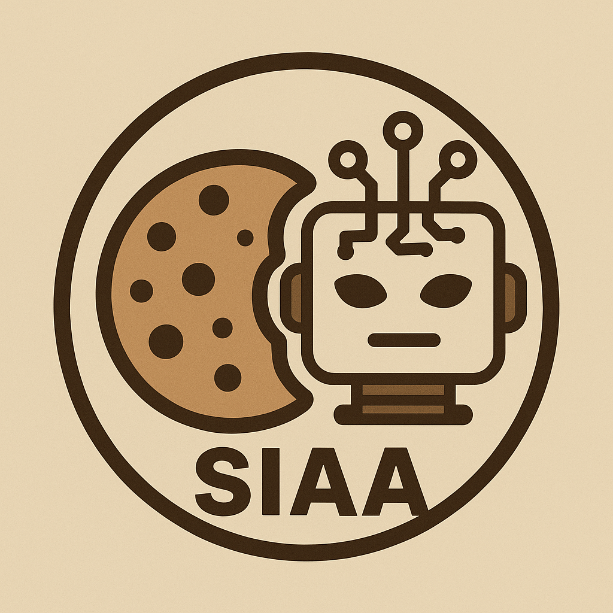

# Bem-vindo ao SIAA GenAI Template

Este é um template **Cookiecutter** projetado para acelerar a criação de projetos robustos e prontos para produção de APIs baseadas em Modelos de Linguagem (LLMs).

Ele foi construído com as melhores práticas de MLOps em mente, oferecendo uma estrutura flexível que se adapta às suas necessidades, seja para um simples endpoint de inferência, uma aplicação RAG complexa ou um sistema multi-agente.

**Por que usar este template?**

-   **Rapidez:** Gere um projeto completo em minutos, com toda a estrutura e configuração prontas.
-   **Padrão:** Garanta que todos os projetos da sua equipe sigam a mesma arquitetura, facilitando a colaboração e a manutenção.
-   **Flexibilidade:** Ative funcionalidades avançadas como RAG, Agentes e Hydra apenas quando precisar, mantendo o projeto limpo.
-   **Pronto para Produção:** Inclui Docker, CI/CD, e uma estrutura escalável desde o início.